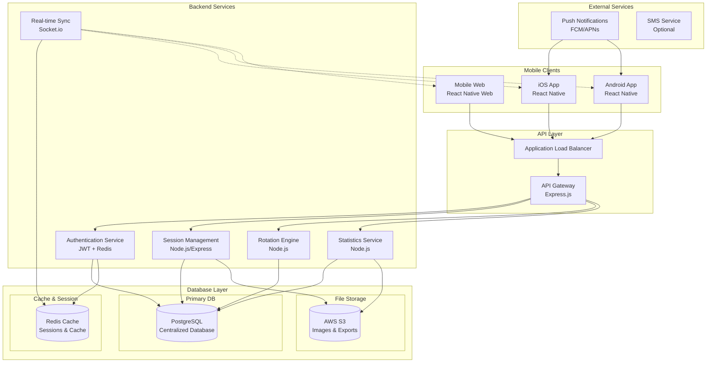
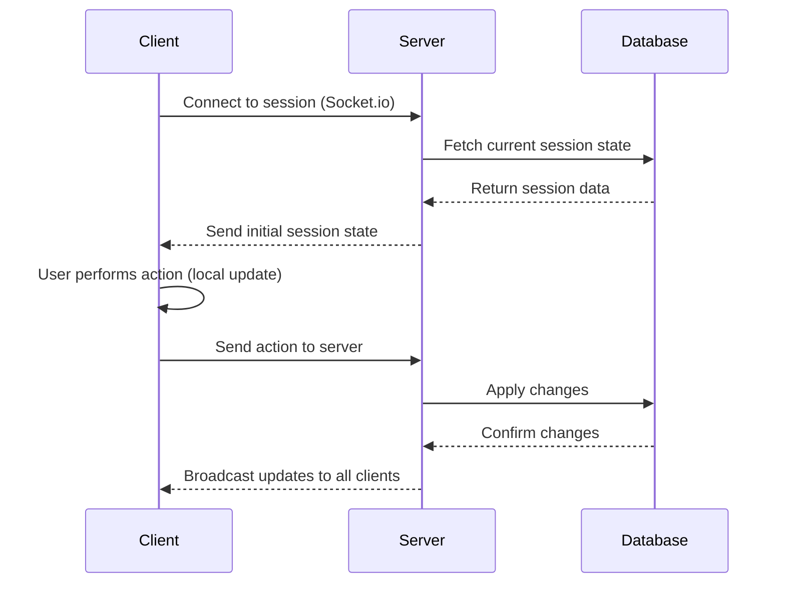

# 🏗️ Badminton Group Management App - System Architecture

## 📋 Architecture Overview

This document outlines the technical architecture for the badminton pairing management application, designed to run on iOS, Android, and mobile web browsers with a centralized PostgreSQL backend.

### 🏛️ System Architecture Diagram



## 🏗️ Technology Stack

### Frontend (React Native)
- **Framework**: React Native 0.72+
- **Navigation**: React Navigation 6.x
- **State Management**: Redux Toolkit + RTK Query
- **Real-time**: Socket.io-client
- **UI Components**: React Native Elements + Custom Components
- **Storage**: AsyncStorage + Redux Persist (Offline Support)
- **Web Support**: React Native Web

### Backend (Node.js + Express)
- **Runtime**: Node.js 18+
- **Framework**: Express.js 4.x
- **Real-time**: Socket.io
- **Authentication**: JWT + Passport.js
- **Validation**: Joi
- **CORS**: cors middleware
- **Security**: Helmet, Rate limiting
- **Logging**: Winston + Morgan

### Database
- **Primary**: PostgreSQL 15+
- **ORM**: Prisma 5.x (Type Safety)
- **Migration**: Prisma Migrate
- **Connection Pool**: PgBouncer (Optional)
- **Backup**: Automated PostgreSQL backups

### DevOps & Deployment
- **Container**: Docker + Docker Compose
- **Orchestration**: Kubernetes (Production)
- **CI/CD**: GitHub Actions
- **Monitoring**: Prometheus + Grafana
- **Logging**: ELK Stack
- **CDN**: CloudFlare (Web)

## 📊 Database Schema Design

### Core Entities

```sql
-- Users (Players and Session Owners)
CREATE TABLE users (
    id UUID PRIMARY KEY DEFAULT gen_random_uuid(),
    name VARCHAR(100) NOT NULL,
    email VARCHAR(255) UNIQUE,
    phone VARCHAR(20),
    avatar_url TEXT,
    device_id VARCHAR(255),
    role VARCHAR(20) DEFAULT 'player', -- 'owner' or 'player'
    created_at TIMESTAMP DEFAULT NOW(),
    updated_at TIMESTAMP DEFAULT NOW()
);

-- Sessions (Badminton Games/Sessions)
CREATE TABLE sessions (
    id UUID PRIMARY KEY DEFAULT gen_random_uuid(),
    name VARCHAR(200) NOT NULL, -- City + Date + Time format
    owner_id UUID REFERENCES users(id),
    scheduled_at TIMESTAMP NOT NULL,
    location TEXT,
    max_players INTEGER DEFAULT 20,
    skill_level VARCHAR(50),
    cost DECIMAL(10,2),
    description TEXT,
    status VARCHAR(20) DEFAULT 'active', -- 'active', 'completed', 'cancelled'
    created_at TIMESTAMP DEFAULT NOW(),
    updated_at TIMESTAMP DEFAULT NOW()
);

-- Session Players (Many-to-many relationship)
CREATE TABLE session_players (
    id UUID PRIMARY KEY DEFAULT gen_random_uuid(),
    session_id UUID REFERENCES sessions(id),
    user_id UUID REFERENCES users(id),
    joined_at TIMESTAMP DEFAULT NOW(),
    status VARCHAR(20) DEFAULT 'active', -- 'active', 'resting', 'left'
    games_played INTEGER DEFAULT 0,
    wins INTEGER DEFAULT 0,
    losses INTEGER DEFAULT 0,
    UNIQUE(session_id, user_id)
);

-- Courts (1-4 courts per session)
CREATE TABLE courts (
    id UUID PRIMARY KEY DEFAULT gen_random_uuid(),
    session_id UUID REFERENCES sessions(id),
    name VARCHAR(50) NOT NULL,
    max_players INTEGER DEFAULT 4,
    status VARCHAR(20) DEFAULT 'available', -- 'available', 'occupied', 'maintenance'
    created_at TIMESTAMP DEFAULT NOW()
);

-- Games (Individual matches)
CREATE TABLE games (
    id UUID PRIMARY KEY DEFAULT gen_random_uuid(),
    session_id UUID REFERENCES sessions(id),
    court_id UUID REFERENCES courts(id),
    player1_id UUID REFERENCES users(id),
    player2_id UUID REFERENCES users(id),
    player3_id UUID REFERENCES users(id), -- Doubles
    player4_id UUID REFERENCES users(id), -- Doubles
    score VARCHAR(10), -- '2-0', '2-1', etc.
    winner_team INTEGER, -- 1 or 2 (for doubles)
    duration_minutes INTEGER,
    recorded_by UUID REFERENCES users(id), -- Who recorded the score
    status VARCHAR(20) DEFAULT 'completed', -- 'ongoing', 'completed', 'disputed'
    created_at TIMESTAMP DEFAULT NOW(),
    updated_at TIMESTAMP DEFAULT NOW()
);

-- Rotation Queue (For fair rotation management)
CREATE TABLE rotation_queue (
    id UUID PRIMARY KEY DEFAULT gen_random_uuid(),
    session_id UUID REFERENCES sessions(id),
    user_id UUID REFERENCES users(id),
    position INTEGER NOT NULL, -- Position in rotation queue
    priority_score INTEGER DEFAULT 0, -- Based on games played
    created_at TIMESTAMP DEFAULT NOW(),
    updated_at TIMESTAMP DEFAULT NOW(),
    UNIQUE(session_id, user_id)
);

-- Rest Requests (歇一下功能)
CREATE TABLE rest_requests (
    id UUID PRIMARY KEY DEFAULT gen_random_uuid(),
    session_id UUID REFERENCES sessions(id),
    user_id UUID REFERENCES users(id),
    requested_at TIMESTAMP DEFAULT NOW(),
    approved_at TIMESTAMP,
    approved_by UUID REFERENCES users(id),
    duration_minutes INTEGER DEFAULT 15,
    status VARCHAR(20) DEFAULT 'pending', -- 'pending', 'approved', 'rejected'
    expires_at TIMESTAMP,
    created_at TIMESTAMP DEFAULT NOW()
);

-- Leave Requests (离场功能)
CREATE TABLE leave_requests (
    id UUID PRIMARY KEY DEFAULT gen_random_uuid(),
    session_id UUID REFERENCES sessions(id),
    user_id UUID REFERENCES users(id),
    requested_at TIMESTAMP DEFAULT NOW(),
    approved_at TIMESTAMP,
    approved_by UUID REFERENCES users(id),
    reason TEXT,
    status VARCHAR(20) DEFAULT 'pending', -- 'pending', 'approved', 'rejected'
    created_at TIMESTAMP DEFAULT NOW()
);
```

## 🔐 Authentication & Authorization

### JWT-Based Authentication
- **Access Token**: 15 minutes expiration
- **Refresh Token**: 7 days expiration
- **Session Management**: Redis for token blacklisting

### Role-Based Access Control (RBAC)
```javascript
const ROLES = {
  OWNER: 'owner',    // Full access to session
  PLAYER: 'player'   // Limited access
};

const PERMISSIONS = {
  CREATE_SESSION: [ROLES.OWNER],
  EDIT_SESSION: [ROLES.OWNER],
  DELETE_SESSION: [ROLES.OWNER],
  ADD_PLAYERS: [ROLES.OWNER],
  RECORD_SCORES: [ROLES.OWNER, ROLES.PLAYER],
  REQUEST_REST: [ROLES.PLAYER],
  APPROVE_REST: [ROLES.OWNER],
  // ... more permissions
};
```

## 📱 Frontend Architecture

### App Structure (React Native)
```
src/
├── components/
│   ├── common/           # Shared components
│   ├── session/          # Session-related components
│   ├── player/           # Player management components
│   ├── rotation/         # Rotation system components
│   └── ui/               # UI components
├── screens/
│   ├── auth/             # Login/Register screens
│   ├── sessions/         # Session list and details
│   ├── rotation/         # Rotation management
│   ├── pairing/          # Player pairing screens
│   └── profile/          # User profile
├── services/
│   ├── api/              # API calls
│   ├── socket/           # Real-time services
│   ├── storage/          # Local storage
│   └── sync/             # Data synchronization
├── store/                # Redux store
├── navigation/           # App navigation
├── utils/                # Utility functions
└── constants/            # App constants
```

### Key Components

#### 1. Rotation Engine (Frontend)
```typescript
interface RotationRule {
  minPlayers: number;
  maxPlayers: number;
  playersToRotate: number;
}

class RotationEngine {
  // Core rotation logic
  calculateRotation(sessionId: string): Player[] {
    // Implementation based on PRD rules
  }

  // Smart pairing algorithm
  generatePairings(players: Player[]): Pairing[] {
    // Based on games played and history
  }
}
```

#### 2. Real-time Sync Service
```typescript
class SyncService {
  private socket: Socket;

  connect(sessionId: string) {
    this.socket = io(SERVER_URL);
    this.socket.emit('join-session', sessionId);
  }

  onRotationUpdate(callback: (data: any) => void) {
    this.socket.on('rotation-updated', callback);
  }

  updatePlayerStatus(playerId: string, status: PlayerStatus) {
    this.socket.emit('player-status-update', { playerId, status });
  }
}
```

## 🌐 API Design

### REST Endpoints Structure

#### Authentication
- `POST /auth/login` - User login
- `POST /auth/register` - User registration
- `POST /auth/refresh` - Refresh access token
- `POST /auth/logout` - Logout user

#### Sessions
- `GET /sessions` - List user's sessions
- `POST /sessions` - Create new session
- `GET /sessions/:id` - Get session details
- `PUT /sessions/:id` - Update session
- `DELETE /sessions/:id` - Delete session

#### Players
- `POST /sessions/:id/players` - Add player to session
- `DELETE /sessions/:id/players/:playerId` - Remove player
- `PUT /sessions/:id/players/:playerId/status` - Update player status

#### Rotation System
- `GET /sessions/:id/rotation` - Get current rotation state
- `POST /sessions/:id/rotation/trigger` - Trigger rotation
- `PUT /sessions/:id/rotation/manual` - Manual rotation adjustment

#### Games & Scoring
- `POST /sessions/:id/games` - Record new game
- `PUT /sessions/:id/games/:gameId` - Update game result
- `GET /sessions/:id/games` - Get session games

#### Statistics
- `GET /sessions/:id/stats` - Session statistics
- `GET /users/:id/stats` - User statistics

### Real-time Events (Socket.io)
- `session-updated` - When session data changes
- `rotation-triggered` - When rotation occurs
- `player-joined` - When player joins session
- `player-left` - When player leaves session
- `score-recorded` - When game score is recorded

## 🔄 Data Synchronization Strategy

### Offline-First Approach
1. **Local Storage**: Redux Persist with AsyncStorage
2. **Optimistic Updates**: Immediate UI updates
3. **Conflict Resolution**: Timestamp-based resolution
4. **Background Sync**: When connection restored

### Real-time Sync Flow


## 📦 Deployment Strategy

### Development Environment
```yaml
# docker-compose.yml
version: '3.8'
services:
  postgres:
    image: postgres:15
    environment:
      POSTGRES_DB: badminton_db
      POSTGRES_USER: user
      POSTGRES_PASSWORD: password

  redis:
    image: redis:7-alpine

  backend:
    build: ./backend
    ports:
      - "3001:3001"
    depends_on:
      - postgres
      - redis

  frontend:
    build: ./frontend
    ports:
      - "3000:3000"
```

### Production Environment
- **Container Registry**: AWS ECR or Docker Hub
- **Orchestration**: AWS EKS or self-hosted Kubernetes
- **Database**: AWS RDS PostgreSQL
- **Cache**: AWS ElastiCache Redis
- **CDN**: CloudFlare for web version
- **Monitoring**: AWS CloudWatch + X-Ray

### Mobile App Deployment
- **iOS**: TestFlight (dev) → App Store (prod)
- **Android**: Google Play Internal Testing → Google Play Store
- **Web**: Deploy to Vercel/Netlify with PWA support

## 🔒 Security Considerations

### API Security
- **Rate Limiting**: Express rate limit middleware
- **Input Validation**: Joi schemas
- **SQL Injection**: Parameterized queries with Prisma
- **CORS**: Configured for mobile and web origins
- **HTTPS**: Enforced everywhere

### Data Security
- **Encryption**: Data at rest (PostgreSQL encryption)
- **Backup**: Encrypted automated backups
- **PII**: Minimal data collection
- **GDPR**: Data export/deletion endpoints

### Authentication Security
- **Password Hashing**: bcrypt with salt rounds
- **JWT Secrets**: Environment-based rotation
- **Session Management**: Redis-based invalidation

## 📊 Monitoring & Analytics

### Application Monitoring
- **Performance**: Response times, error rates
- **Business**: Session creation, user engagement
- **Technical**: Database queries, cache hit rates

### Logging Strategy
- **Structured Logging**: Winston with JSON format
- **Log Levels**: ERROR, WARN, INFO, DEBUG
- **Centralized**: ELK stack or AWS CloudWatch Logs

### Error Tracking
- **Frontend**: Sentry for React Native
- **Backend**: Sentry for Node.js
- **Mobile**: Firebase Crashlytics

## 🎯 Performance Optimization

### Backend Optimizations
- **Database Indexing**: Strategic indexes on frequently queried columns
- **Caching**: Redis for session data and user profiles
- **Connection Pooling**: Optimize database connections
- **Query Optimization**: Use Prisma's query optimization features

### Frontend Optimizations
- **Code Splitting**: React.lazy for route-based splitting
- **Image Optimization**: Compressed images with WebP support
- **Bundle Size**: Tree shaking and dead code elimination
- **Caching**: Service worker for PWA features

This architecture provides a solid foundation for building a scalable, real-time badminton pairing management application that meets all the requirements specified in the PRD while ensuring performance, security, and maintainability.