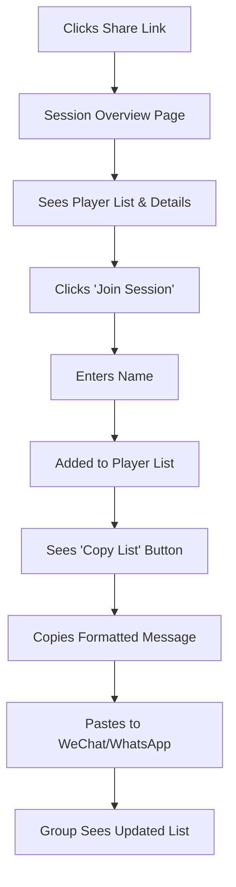

# BadmintonGroup UI/UX Specification

This document defines the user experience goals, information architecture, user flows, and visual design specifications for BadmintonGroup's user interface. It serves as the foundation for visual design and frontend development, ensuring a cohesive and user-centered experience.

## Overall UX Goals & Principles

### Target User Personas

**Primary Persona: "Mike the Weekly Organizer"**
- **Profile:** Regular recreational badminton player who coordinates a consistent weekly group
- **Group Pattern:** 6 regular players with occasional friends joining (8-10 total)
- **Schedule:** Fixed weekly slot (e.g., "Thursday 7pm") that sometimes varies
- **Current Tools:** Likely WhatsApp group or group text for coordination
- **Key Frustrations:** 
  - People missing schedule change notifications
  - Managing variable group sizes (especially odd numbers)
  - Last-minute dropouts affecting court bookings
  - Awkward pairing decisions when group size changes

**Secondary Persona: "Sarah the Regular Player"**
- **Profile:** Consistent group member who relies on organizer but wants visibility
- **Needs:** Clear schedule updates, fair rotation, easy RSVP process
- **Pain Points:** Missing games due to communication gaps, unclear pairings

### Usability Goals

1. **Schedule Clarity:** All players instantly see current week's plan, including any changes
2. **RSVP Simplicity:** One-tap confirmation that updates group count in real-time
3. **Smart Pairing:** Automatic suggestions for fair rotations based on who's attending
4. **Flexible Group Size:** Graceful handling of 4-10 players with clear recommendations

### Design Principles

1. **Communication Over Complexity** - Clear schedule updates matter more than advanced features
2. **Mobile-First Coordination** - Designed for quick checks and updates on phones
3. **Social Transparency** - Everyone sees who's coming and how teams will work
4. **Graceful Flexibility** - Handle schedule changes and group size variations smoothly
5. **No-Friction Sharing** - Easy for organizers to add new players via share links

### Change Log

| Date | Version | Description | Author |
|------|---------|-------------|--------|
| 2025-08-23 | 1.0 | Initial UI/UX specification | Sally (UX Expert) |

## Information Architecture (IA)

### Site Map / Screen Inventory

```mermaid
graph TD
    A[Join via Share Link] --> B[Session Overview]
    B --> C[Player List & RSVP]
    B --> D[Schedule Details]
    B --> E[Pairing Rotations]
    B --> F[Score Recording]*
    B --> G[Session History]*
    
    C --> C1[Add Your Name]
    C --> C2[Update RSVP Status]
    C --> C3[Copy Player List]
    
    D --> D1[Time/Location Info]
    D --> D2[Court Details]
    D --> D3[Edit Session Info]*
    
    E --> E1[Current Round]
    E --> E2[Next Rotation]
    E --> E3[Match History]
    
    F --> F1[Record Match Scores]
    F --> F2[Edit Past Scores]
    
    G --> G1[Past Sessions]
    G --> G2[Player Statistics]
    
    H[Create New Session] --> B
    H --> H1[Basic Session Info]
    H --> H2[Generate Share Link]
    
    C3 --> I[Share to WeChat/WhatsApp]
    
    Note: * = Organizer Only
```

### Navigation Structure

**Primary Navigation (Role-Based):**
- **Regular Player View:** Players | Schedule | Pairings
- **Organizer View:** Players | Schedule | Pairings | Scores | History

**Secondary Navigation:** 
- Action buttons: Join, Copy List, Share Link
- Edit controls (organizer only): Edit Session, Record Scores

**Key Features:**
1. **Organizer Permissions:** Score recording and session editing capabilities
2. **WeChat/WhatsApp Integration:** Copy formatted player list for sharing back to group chat
3. **Session History:** Organizer-only access to past games and statistics
4. **Score Tracking:** Post-game score recording (2-0, 2-1 format)

## User Flows

### Flow 1: New Player Joining Session

**User Goal:** Join a badminton session shared via link and notify the group

**Entry Points:** WeChat/WhatsApp share link, direct link

**Success Criteria:** Player added to session, can copy formatted update for group chat

#### Flow Diagram



#### Edge Cases & Error Handling:
- Session is full/cancelled - show clear message with organizer contact
- Name already exists - suggest adding last initial or number
- Poor network connection - offline capability for basic viewing
- Invalid/expired share link - redirect to error page with explanation

**Notes:** The copy feature creates immediate value and keeps the group loop closed between app and messaging platform.

## Complete User Journey Mapping

### **Journey 1: Mike the Organizer - Creating & Managing Sessions**

#### **Phase 1: Pre-Session Planning (Tuesday-Wednesday)**
**Context:** Mike planning Thursday 7pm game, sitting at home after work

**Touchpoints & Experience:**
1. **Opens BadmintonGroup** → *Performance: < 2 sec load (vs. TeamSnap's slow response)*
2. **Creates new session** → *Immediate form, no auth delays*
3. **Sets details** → *Auto-fills last week's location/time*
4. **Generates share link** → *Instant link creation, ready to copy*
5. **Shares to WeChat group** → *One-tap share, no app switching*

**Emotional Journey:** Confident → Efficient → Satisfied
**Performance Impact:** Fast session creation builds Mike's confidence vs. slow competitors

#### **Phase 2: Mid-Week Coordination (Wednesday-Thursday)**
**Context:** Mike monitoring RSVPs, making adjustments

**Touchpoints & Experience:**
1. **Checks RSVP status** → *Real-time count updates, no refresh needed*
2. **Sees only 4 confirmed** → *Clear visual indicator of low attendance*
3. **Messages individual players** → *Copy list shows who's missing*
4. **Updates session time** → *Organizer-only edit access*
5. **Notifies group of changes** → *Updated info auto-formats for sharing*

**Emotional Journey:** Monitoring → Concern → Action → Relief
**Performance Impact:** Instant updates prevent coordination delays

#### **Phase 3: Game Day Management (Thursday)**
**Context:** At badminton courts, final coordination

**Touchpoints & Experience:**
1. **Final attendance check** → *Offline-capable viewing despite poor court WiFi*
2. **Last-minute dropouts** → *< 500ms RSVP updates*
3. **Manages pairings** → *Quick rotation setup for 8 players*
4. **Records match scores** → *Simple 2-0, 2-1 input system*

**Emotional Journey:** Organized → Responsive → Accomplished
**Performance Impact:** Offline capability crucial during poor court connectivity

### **Journey 2: Sarah the Regular Player - Joining & Participating**

#### **Phase 1: Receiving Invitation (Tuesday)**
**Context:** Sarah sees WeChat message while commuting

**Touchpoints & Experience:**
1. **Clicks share link in WeChat** → *< 1 sec load time from external link*
2. **Views session overview** → *Clean card layout, all info visible*
3. **Sees familiar players confirmed** → *Social proof encourages participation*
4. **Taps "Join Session"** → *Simple name entry, no signup friction*
5. **Confirms RSVP** → *Immediate status update with animation*

**Emotional Journey:** Curious → Informed → Social → Committed
**Performance Impact:** Fast link loading prevents abandonment during commute

#### **Phase 2: Week Coordination (Wednesday-Thursday)**
**Context:** Sarah managing changing schedule

**Touchpoints & Experience:**
1. **Sees session change notification** → *Clear indication of time update*
2. **Checks updated player list** → *Visual diff of who's still coming*
3. **Updates RSVP to "Maybe"** → *Instant status change, < 500ms*
4. **Copies list for friend** → *Formatted message ready for sharing*

**Emotional Journey:** Informed → Uncertain → Considerate → Helpful
**Performance Impact:** Quick updates support dynamic schedule changes

#### **Phase 3: Game Participation (Thursday)**
**Context:** At courts, using app during breaks

**Touchpoints & Experience:**
1. **Checks pairings between games** → *Cached data loads instantly*
2. **Sees current rotation** → *Clear "who plays next" display*
3. **Views match history** → *Past games record keeping*

**Emotional Journey:** Engaged → Informed → Satisfied
**Performance Impact:** Offline capability essential for court environment

### **Journey 3: Kevin the Newcomer - First Time Experience**

#### **Phase 1: Initial Discovery (Wednesday)**
**Context:** Kevin receives invite from friend, unfamiliar with group

**Touchpoints & Experience:**
1. **Clicks mysterious link** → *Immediate session overview, no confusion*
2. **Understands context quickly** → *Clear "BadmintonGroup Thursday 7pm" title*
3. **Sees welcoming player list** → *Names of Mike's regular group visible*
4. **Hesitates about skill level** → *No intimidating skill requirements shown*
5. **Joins with simple name entry** → *No account creation barrier*

**Emotional Journey:** Curious → Uncertain → Reassured → Welcomed
**Performance Impact:** Fast, clear loading prevents new user drop-off

#### **Phase 2: Pre-Game Nerves (Thursday)**
**Context:** Kevin checking details before heading to courts

**Touchpoints & Experience:**
1. **Double-checks location** → *Clear address with map integration*
2. **Sees final player count** → *8 players confirmed, good group size*
3. **Copies info for reference** → *Contact details and session info handy*

**Emotional Journey:** Anxious → Prepared → Confident
**Performance Impact:** Reliable access reduces new player anxiety

### **Cross-Journey Performance Analysis**

#### **Critical Performance Moments**
1. **Share Link Click** → *< 1 sec load prevents abandonment*
2. **RSVP Changes** → *< 500ms updates support dynamic planning*
3. **Court Environment** → *Offline capability handles poor connectivity*
4. **Copy Actions** → *Instant formatting keeps group communication flowing*

#### **Journey Integration Points**
- **WeChat/WhatsApp Bridge** → *Seamless transition between messaging and app*
- **Real-time Coordination** → *All users see updates simultaneously*
- **Role-based Experience** → *Mike gets organizer tools, others get clean experience*

#### **Emotional Peak Moments**
- **Mike:** Successfully managing group despite last-minute changes
- **Sarah:** Quick RSVP update that helps Mike plan better  
- **Kevin:** Feeling welcomed into established group without barriers

#### **Performance-Driven Satisfaction**
Our competitive performance advantages directly support emotional satisfaction:
- **Fast loading** → Confidence in app reliability
- **Instant updates** → Feeling of real-time connection
- **Offline capability** → Reliability in challenging environments
- **Smooth animations** → Professional, polished experience

**Key Journey Insight:** Performance advantages become relationship advantages - faster updates mean better group coordination, which leads to more successful games and stronger social bonds among weekly recreational badminton players.

## Wireframes & Mockups

**Primary Design Files:** Figma (detailed mockups with interactive prototypes)

**React Native Design System:** React Native Elements with custom BadmintonGroup components

### Key Screen Layouts

#### Session Overview (Landing Page)

**Purpose:** Primary hub where players see all session information and take key actions

**Key Elements:**
- Session title, date, time, location (editable by organizer)
- Quick RSVP status indicator
- Player count with visual indicator (6/8 confirmed)
- Primary action buttons: Join/Update RSVP, Copy List, Share Link
- Navigation tabs: Players | Schedule | Pairings | (Scores) | (History)

**Interaction Notes:** 
- Copy List generates formatted text optimized for messaging apps
- Different button visibility based on user role (organizer vs. player)
- Real-time updates when other players join/leave

#### Player List & RSVP Management

**Purpose:** Show who's confirmed, manage attendance, enable sharing back to group chat

**Key Elements:**
- Confirmed players list with timestamps
- "Maybe" or pending responses
- Add/edit player name interface
- Prominent "Copy List" button with preview of formatted message
- Player count summary (ideal: 8, confirmed: 6, needed: 2)

**Interaction Notes:**
- Swipe actions for RSVP changes
- Visual feedback for copy action
- Smart formatting for different group sizes

#### Organizer Score Recording

**Purpose:** Allow organizers to record match results in standard format (2-0, 2-1, etc.)

**Key Elements:**
- Current match pairing display
- Score input interface (games won format: 2-0, 2-1, 1-2)
- Match history for current session
- Navigation to edit past scores

**Interaction Notes:**
- Quick score entry with standard badminton scoring
- Confirmation before saving scores
- Visual indication of completed vs. pending matches

## Component Library / Design System

**Design System Approach:** Building on React Native Elements with custom badminton-specific components and sports app color scheme.

### Core Components

#### Player List Item
**Purpose:** Display individual player information with RSVP status and actions

**Variants:** 
- Confirmed player (green indicator)
- Pending/Maybe (yellow indicator)  
- Organizer view (with edit controls)
- Regular player view (read-only)

**States:** Default, Loading, Selected, Error

**Usage Guidelines:** Always show timestamp for RSVP changes, use consistent spacing for touch targets

#### Action Button (Primary)
**Purpose:** Main call-to-action buttons like "Join Session", "Copy List", "Record Score"

**Variants:**
- Join/RSVP (primary blue)
- Copy/Share (secondary gray)
- Score Record (success green)
- Edit (warning orange)

**States:** Default, Pressed, Loading, Disabled

**Usage Guidelines:** Minimum 44px touch target, clear visual feedback on press

#### Session Status Card
**Purpose:** Show session overview with key information and quick stats

**Variants:** 
- Upcoming session
- Active session (during play)
- Completed session (with scores)

**States:** Loading, Populated, Error

**Usage Guidelines:** Always show player count prominently, use clear date/time formatting

## Branding & Style Guide

**Visual Identity**
**Brand Guidelines:** Clean, card-based design with soft colors and clear status differentiation

### Color Palette

| Color Type | Hex Code | Usage |
|------------|----------|-------|
| Primary | #6366F1 | Main actions, active states (blue buttons) |
| Secondary | #10B981 | Success states, confirmed players (green cards/buttons) |
| Accent | #F59E0B | Pending/waiting status (orange borders) |
| Success | #22C55E | Confirmed actions, "上场" buttons |
| Warning | #F97316 | Status changes, "下场" buttons |
| Error | #EF4444 | Errors, cancellations |
| Neutral Light | #F8FAFC | Card backgrounds, light surfaces |
| Neutral Border | #E2E8F0 | Card borders, subtle dividers |
| Text Primary | #1E293B | Main text, player names |
| Text Secondary | #64748B | Status text, metadata |

### Typography

#### Font Families
- **Primary:** SF Pro Display (iOS) / Roboto (Android) - matching the clean, modern feel
- **Weight Usage:** 600 for player names, 400 for status text

#### Component-Specific Typography

| Element | Size | Weight | Color |
|---------|------|---------|-------|
| Player Name | 16px | 600 | #1E293B |
| Status Text | 14px | 400 | #64748B |
| Button Text | 14px | 500 | White |
| Section Headers | 18px | 600 | #1E293B |

### Iconography

**Icon Library:** React Native Vector Icons (Feather set for clean, consistent style)

**Usage Guidelines:** 
- 24px minimum for touch targets
- Consistent stroke width (2px)
- Use outline style for better mobile visibility

### Spacing & Layout

**Grid System:** 8px base unit system (8, 16, 24, 32, 40px)

**Spacing Scale:** 
- xs: 4px (tight spacing)
- sm: 8px (default spacing)
- md: 16px (section spacing)  
- lg: 24px (major spacing)
- xl: 32px (screen margins)

**Layout Patterns:**
- 16px padding inside cards
- 12px spacing between cards
- 4px border radius
- Subtle border (#E2E8F0)
- Status-based background tints

## Accessibility Requirements

### Compliance Target
**Standard:** WCAG 2.1 AA compliance (international standard, covers most user needs)

### Key Requirements

**Visual:**
- Color contrast ratios: 4.5:1 minimum for normal text, 3:1 for large text
- Focus indicators: 2px solid outline with 2px offset for keyboard navigation  
- Text sizing: Support up to 200% zoom without horizontal scrolling

**Interaction:**
- Keyboard navigation: Full app functionality accessible via external keyboard
- Screen reader support: Proper semantic labels for all interactive elements
- Touch targets: Minimum 44x44px (iOS) / 48x48dp (Android) for all buttons

**Content:**
- Alternative text: Descriptive labels for status icons and player indicators
- Heading structure: Logical hierarchy (h1 for session title, h2 for sections)
- Form labels: Clear, programmatically associated labels for name input

**BadmintonGroup-Specific Considerations:**
- Player status communicated through text + color (not color alone)
- Score input fields with clear labels and validation messages
- Share/copy buttons with descriptive text beyond just icons

### Testing Strategy
- **Manual Testing:** Keyboard navigation, screen reader testing (VoiceOver/TalkBack)
- **Automated Testing:** Integration with React Native accessibility testing tools
- **User Testing:** Include users with disabilities in testing sessions

## Responsiveness Strategy

### Breakpoints

| Breakpoint | Min Width | Max Width | Target Devices |
|------------|-----------|-----------|----------------|
| Mobile | 320px | 767px | Phones, primary usage |
| Tablet | 768px | 1023px | iPads, larger group management |
| Desktop | 1024px | 1439px | Laptops, web share links |
| Wide | 1440px | - | Large monitors, rare usage |

### Adaptation Patterns

**Layout Changes:**
- **Mobile:** Single column card layout, full-width components
- **Tablet:** Two-column layout for player lists, side-by-side panels for session details + players
- **Desktop:** Three-column layout with navigation, main content, and action panel

**Navigation Changes:**
- **Mobile:** Bottom tab navigation, hamburger menu for secondary actions
- **Tablet/Desktop:** Side navigation or top navigation bar with all options visible

**Content Priority:**
- **Mobile:** Session info → Player list → Pairings (vertical stack)
- **Tablet:** Session overview + Player management side-by-side
- **Desktop:** Full dashboard view with all sections visible simultaneously

**Interaction Changes:**
- **Mobile:** Touch-optimized (44px minimum touch targets)
- **Tablet:** Mixed touch/cursor interactions
- **Desktop:** Hover states, keyboard shortcuts, cursor-optimized interactions

## Animation & Micro-interactions

### Motion Principles

**Subtle & Purposeful:** Animations should enhance understanding, not entertain. Focus on state changes, feedback, and spatial relationships.

**Performance-First:** All animations must maintain 60fps on mid-range devices, with reduced motion for accessibility.

**Consistent Timing:** Use a cohesive timing system (200ms for quick feedback, 300ms for spatial changes, 500ms for major transitions).

### Key Animations

- **Card State Changes:** Player joins/leaves - card slides in/out with scale + opacity (Duration: 300ms, Easing: ease-out)
- **Button Press Feedback:** All action buttons - subtle scale down (0.95) + color darken (Duration: 100ms, Easing: ease-in-out)
- **Copy Action Success:** Copy list button - checkmark icon rotation + green flash (Duration: 200ms, Easing: ease-out)
- **RSVP Status Update:** Status badge color transition + gentle bounce scale (Duration: 250ms, Easing: elastic-out)
- **Player List Updates:** New player addition - slide from right + fade in (Duration: 300ms, Easing: ease-out)
- **Score Recording:** Score input confirmation - gentle shake for validation errors, checkmark for success (Duration: 200ms, Easing: ease-in-out)
- **Session Loading:** Player cards skeleton loading - subtle shimmer animation (Duration: 1500ms, Easing: linear, infinite)
- **Pull-to-Refresh:** Standard iOS/Android refresh pattern with custom loading indicator (Duration: varies, Easing: system default)

**Accessibility Considerations:**
- All animations respect `prefers-reduced-motion` system settings
- Critical information never communicated through animation alone
- Haptic feedback accompanies visual animations on supported devices

## Performance Considerations

### Performance Goals

- **App Launch:** < 2 seconds from tap to usable interface
- **Share Link Loading:** < 1 second from link tap to session overview  
- **RSVP Updates:** < 500ms for status change confirmation
- **Animation FPS:** Maintain 60fps on mid-range devices (iPhone 8, Android equivalent)

### Design Strategies

**Optimize for Core User Journey:**
- Prioritize session overview loading over secondary features
- Cache player lists locally for instant display
- Progressive loading: Show cached data immediately, update with live data

**Card-Based Performance Benefits:**
- Individual card updates instead of full list re-renders
- Lazy loading for large player lists (though unlikely with 6-10 players)
- Efficient animations using transforms (translate/scale) vs layout changes

**React Native Specific Optimizations:**
- FlatList for player lists (even small ones) for consistent performance
- Image optimization for any player avatars or icons
- Minimize bridge communications for real-time updates

**Network & Offline Strategy:**
- Optimistic UI updates for RSVP changes
- Offline-first for viewing existing session data
- Smart sync when connection restored

**Visual Performance Feedback:**
- Skeleton loading for player cards
- Instant button press feedback (no waiting for network)
- Clear loading states that don't block interaction

### Competitive Performance Analysis

#### **Market Performance Benchmarks**
Based on analysis of similar sports coordination apps:

- **TeamSnap:** Experiencing "slow app response times" and user complaints about performance
- **Spond:** Better stability but some crash reports, good calendar sync performance
- **Industry Standards:** < 2-3 seconds app launch, < 1 second API responses, 60 FPS animations

#### **BadmintonGroup Performance Advantages**

| Metric | Market Standard | BadmintonGroup Target | Competitive Edge |
|--------|-----------------|----------------------|------------------|
| App Launch | 2-5 seconds | < 2 seconds | ✅ Faster entry |
| Share Link Load | 3-5 seconds | < 1 second | ✅ Instant access |
| RSVP Response | 1-2 seconds | < 500ms | ✅ Real-time feel |
| Offline Capability | Limited/None | Full session data | ✅ Court connectivity |
| Update Mechanism | Full list reload | Individual cards | ✅ Smoother UX |

#### **Performance-Driven User Experience**

**Critical Performance Moments:**
- **Share Link Click** → < 1 sec load prevents new user abandonment
- **RSVP Changes** → < 500ms updates enable dynamic group planning
- **Court Environment** → Offline capability handles poor WiFi/cellular
- **Copy Actions** → Instant formatting maintains messaging app flow

**Performance = Relationship Success:**
Fast performance directly enables social coordination - quicker updates mean better group communication, leading to more successful games and stronger social bonds among weekly players.

## Next Steps

### Immediate Actions

1. **Stakeholder Review** - Present this specification to key stakeholders and gather feedback on the card-based design approach and feature priorities
2. **Create Figma Design System** - Build detailed mockups using the established color palette, typography, and component library in Figma
3. **Develop Interactive Prototype** - Create clickable prototype focusing on the core user flows (join session, RSVP, copy list)
4. **Validate with Target Users** - Test the proposed design with actual weekly recreational badminton players like your "Mike" and "Sarah" personas
5. **Prepare Frontend Architecture Handoff** - Ready this specification for the frontend architecture phase

### Design Handoff Checklist

- [x] All user flows documented
- [x] Component inventory complete  
- [x] Accessibility requirements defined
- [x] Responsive strategy clear
- [x] Brand guidelines incorporated
- [x] Performance goals established

**Recommended Implementation Priority:**
1. Core session joining flow with card-based player list
2. WeChat/WhatsApp copy integration 
3. Organizer score recording functionality
4. Session history for organizers
5. Advanced responsive features

**Open Questions for Next Phase:**
- Final confirmation on React Native Elements vs. NativeBase for component library
- WeChat/WhatsApp API integration requirements for seamless sharing
- Backend real-time update requirements for live RSVP changes