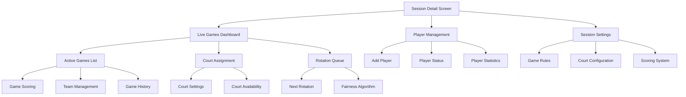
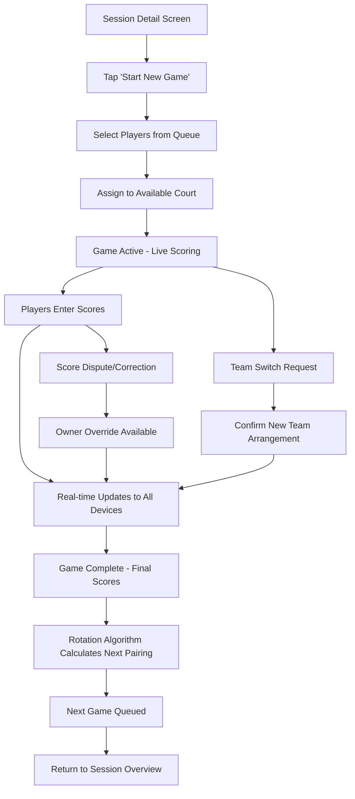
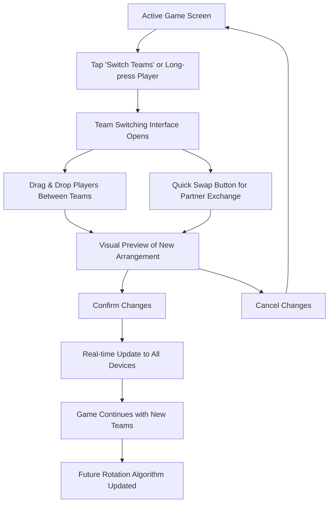

# BadmintonGroup UI/UX Specification

This document defines the user experience goals, information architecture, user flows, and visual design specifications for BadmintonGroup's Enhanced Live Games system. It serves as the foundation for visual design and frontend development, ensuring a cohesive and user-centered experience.

## Overall UX Goals & Principles

### Target User Personas

**Session Organizer:** Experienced players who coordinate group sessions and manage rotations. They need efficient tools for fair player distribution and clear visibility into game progress across multiple courts.

**Active Player:** Regular participants who want real-time game tracking and statistics. They value quick score entry, transparent rotation systems, and seamless team coordination during live play.

**Social Coordinator:** Players focused on group harmony and inclusive participation. They prioritize features that ensure everyone gets balanced gameplay and clear communication about game status.

### Usability Goals

- **Real-time Responsiveness:** Score updates and game state changes reflected across all devices within 200ms for immediate feedback during fast-paced gameplay
- **One-handed Operation:** All critical game functions accessible with single thumb operation for courtside usage while holding equipment
- **Glanceable Information:** Key game status (scores, next rotation, court assignments) visible in under 3 seconds during quick courtside checks
- **Fair Play Transparency:** Rotation algorithms and team assignments clearly visible to all participants to maintain social harmony and trust

### Design Principles

1. **Fairness Through Transparency** - All rotation logic and team assignments are visible and explainable to maintain group social harmony
2. **Mobile-First Live Action** - Every interaction optimized for quick, accurate input during active gameplay scenarios
3. **Social Coordination Priority** - Features designed to strengthen group cohesion rather than individual competition
4. **Graceful Network Degradation** - Core functionality maintains reliability even with poor court WiFi connectivity
5. **Inclusive Participation** - Interface accommodates players of all skill levels and technology comfort

## Information Architecture (IA)

### Site Map / Screen Inventory

### Navigation Structure

**Primary Navigation:** Bottom tab bar with Session Overview, Live Games, Players, and Settings - optimized for thumb reach during courtside usage

**Secondary Navigation:** Contextual action sheets and modal overlays for game-specific actions (scoring, team switching, rotation management)

**Breadcrumb Strategy:** Clear visual hierarchy with session name → current game → specific action, enabling quick orientation during fast game transitions

## User Flows

### Core Game Management Flow

**User Goal:** Start and manage a live badminton game with real-time scoring and fair team rotation

**Entry Points:** Session Detail Screen → "Start New Game" button, or from rotation queue via "Next Game" action

**Success Criteria:** Game completed with accurate scores recorded, next rotation automatically queued, all participants updated via real-time sync

#### Flow Diagram

#### Edge Cases & Error Handling:
- **Network Disconnection:** Optimistic UI updates with sync queue, visible offline indicator
- **Score Conflicts:** Last-update-wins with owner override capability for dispute resolution
- **Player Unavailable:** Automatic rotation recalculation with substitute player suggestion
- **Court Capacity Exceeded:** Clear visual feedback and alternative court suggestion

**Notes:** Flow emphasizes immediate feedback and social harmony through transparent processes and clear dispute resolution mechanisms.

### Team Switching During Live Games Flow

**User Goal:** Flexibly rearrange team partnerships during active gameplay without disrupting game flow

**Entry Points:** Active Game Screen → "Switch Teams" button, or long-press on player names for quick team swap

**Success Criteria:** New team arrangement confirmed across all devices, score tracking continues seamlessly, rotation algorithm updated for future fairness calculations

#### Flow Diagram

#### Edge Cases & Error Handling:
- **Mid-Rally Switch Request:** Warning about disrupting active play with confirmation required
- **Invalid Team Composition:** Visual validation preventing unbalanced team arrangements
- **Multiple Simultaneous Requests:** Last-update-wins with clear visual feedback about changes
- **Rotation Impact Warning:** Clear indication if switch affects upcoming game fairness

**Notes:** Interface prioritizes speed and clarity for mid-game adjustments while maintaining rotation fairness transparency.

## Wireframes & Mockups

**Primary Design Files:** React Native component specifications with Figma references for detailed visual designs

### Key Screen Layouts

#### Enhanced Live Games Dashboard

**Purpose:** Central hub for managing all active games, court assignments, and rotation queue during live session

**Key Elements:**
- Active Games Cards (current scores, time elapsed, court assignment)
- Next Rotation Preview (upcoming player pairings with fairness indicators)
- Court Status Overview (available/occupied courts with quick assignment)
- Quick Actions Toolbar (start game, emergency stop, settings)

**Interaction Notes:** All cards are touch-optimized for single-handed operation. Swipe gestures for quick actions, tap for detailed management. Real-time updates animate smoothly without disrupting user focus.

**Design File Reference:** [Enhanced-Live-Games-Dashboard.figma](design-files/enhanced-live-games-dashboard)

#### Live Game Scoring Interface

**Purpose:** Fast, accurate score entry and team management during active gameplay

**Key Elements:**
- Large, prominent score displays (current set scores and game points)
- Quick increment/decrement buttons optimized for touch accuracy
- Team switching interface with drag-and-drop capability
- Game timer and set progression indicators

**Interaction Notes:** Score buttons provide immediate haptic feedback with optimistic UI updates. Team switching accessed via swipe gesture or dedicated button. All actions include confirmation feedback visible across court distance.

**Design File Reference:** [Live-Scoring-Interface.figma](design-files/live-scoring-interface)

#### Fair Rotation Algorithm Visualization

**Purpose:** Transparent display of upcoming game pairings with fairness metrics to maintain social harmony

**Key Elements:**
- Next 3 game preview with player matchup visualization
- Fairness indicators showing games played, win/loss balance, partnership distribution
- Manual override capability for session organizers
- Clear explanation of algorithm decisions

**Interaction Notes:** Tap any pairing for detailed fairness breakdown. Swipe to preview further future games. Override controls locked behind owner verification to prevent conflicts.

**Design File Reference:** [Rotation-Algorithm-Display.figma](design-files/rotation-algorithm)

## Component Library / Design System

**Design System Approach:** React Native component library built on established BadmintonGroup design tokens, extended with Enhanced Live Games specific components for real-time gaming functionality

### Core Components

#### LiveGameCard Component

**Purpose:** Display real-time game status with scoring, timing, and team information in compact, glanceable format

**Variants:** 
- Active (currently playing with live updates)
- Queued (waiting to start with player assignments)
- Completed (finished with final scores and statistics)

**States:** 
- Loading (connecting to real-time updates)
- Online (receiving live data)
- Offline (cached data with sync pending)
- Error (connection failed with retry options)

**Usage Guidelines:** Always display court assignment prominently. Use color coding for game urgency (normal, overtime, match point). Include subtle animation for score changes to catch attention without distraction.

#### TeamSwitchInterface Component

**Purpose:** Enable rapid team rearrangement during active games with clear visual feedback and confirmation patterns

**Variants:**
- Drag-and-Drop (full flexibility for team composition)
- Quick-Swap (simple partner exchange with single tap)
- Preset-Teams (common arrangements for quick selection)

**States:**
- Ready (waiting for user interaction)
- Dragging (player being moved with preview feedback)
- Confirming (new arrangement pending confirmation)
- Updating (sending changes to real-time system)

**Usage Guidelines:** Provide immediate visual feedback during dragging. Show team balance preview before confirmation. Include undo capability for accidental changes.

#### RotationQueue Component  

**Purpose:** Display upcoming game pairings with fairness transparency and manual override capabilities

**Variants:**
- Preview-Only (read-only display for regular players)
- Organizer-Control (full editing for session owners)
- Algorithm-Explanation (detailed fairness breakdown)

**States:**
- Calculating (rotation algorithm processing)
- Ready (next games determined and displayed)
- Manual-Override (organizer making adjustments)
- Locked (games in progress, changes restricted)

**Usage Guidelines:** Always show fairness reasoning for pairings. Use progressive disclosure for detailed algorithm explanations. Highlight any manual overrides clearly to maintain transparency.

## Branding & Style Guide

### Visual Identity

**Brand Guidelines:** The BadmintonGroup app maintains a clean, sports-focused identity that balances professionalism with the fun, social nature of recreational badminton. The visual language emphasizes fairness, transparency, and community building.

### Color Palette

| Color Type | Hex Code | Usage |
|------------|----------|--------|
| Primary | #2E7D32 | Main actions, active states, court/game elements |
| Secondary | #1565C0 | Secondary actions, information displays, player indicators |
| Accent | #FF6F00 | Live indicators, notifications, important highlights |
| Success | #388E3C | Match wins, successful actions, positive feedback |
| Warning | #F57C00 | Rotation warnings, timeout alerts, important notices |
| Error | #D32F2F | Errors, invalid moves, connection issues |
| Neutral | #212121, #424242, #757575, #BDBDBD, #E0E0E0, #F5F5F5, #FAFAFA | Text hierarchy, borders, backgrounds, dividers |

### Typography

#### Font Families
- **Primary:** Inter (high legibility for mobile screens, excellent at small sizes)
- **Secondary:** Roboto (native Android feel, consistent with Material Design)
- **Monospace:** SF Mono / Roboto Mono (for scores, timers, statistics)

#### Type Scale

| Element | Size | Weight | Line Height |
|---------|------|--------|-------------|
| H1 | 32px | 700 | 40px |
| H2 | 24px | 600 | 32px |
| H3 | 20px | 600 | 28px |
| Body | 16px | 400 | 24px |
| Small | 14px | 400 | 20px |

### Iconography

**Icon Library:** React Native Vector Icons (Feather set primary, MaterialIcons for platform-specific elements)

**Usage Guidelines:** 
- Icons are primarily 24px with 20px variants for compact layouts
- Stroke width of 2px for Feather icons maintains consistency with typography weight
- Icons should be semantically meaningful and culturally universal
- Game-specific icons (shuttlecock, court layouts) use simplified, recognizable forms
- All icons include proper accessibility labels for screen readers

### Spacing & Layout

**Grid System:** 8px base unit system with 16px, 24px, 32px, 48px, 64px increments

**Spacing Scale:**
- **xs:** 4px (fine adjustments, icon padding)
- **sm:** 8px (tight content spacing)
- **md:** 16px (standard content spacing)
- **lg:** 24px (section separation)
- **xl:** 32px (major section breaks)
- **xxl:** 48px (screen-level spacing)

## Accessibility Requirements

### Compliance Target

**Standard:** WCAG 2.1 AA compliance with React Native accessibility API implementation, optimized for mobile sports contexts

### Key Requirements

**Visual:**
- Color contrast ratios: Minimum 4.5:1 for normal text, 3:1 for large text (18pt+). Enhanced contrast (7:1) for critical game state indicators (scores, active player status, timer displays)
- Focus indicators: High-visibility focus rings with 2px minimum thickness, optimized for outdoor lighting conditions
- Text sizing: Minimum 16px for body text with dynamic type support. Game-critical information (scores, player names, timer) uses minimum 18px with bold weight

**Interaction:**
- Keyboard navigation: Full keyboard support for all interactive elements, though primarily designed for touch-first mobile usage
- Screen reader support: VoiceOver/TalkBack compatibility with descriptive labels for game states, player rotations, and score changes. Live region announcements for real-time updates
- Touch targets: Minimum 44pt touch targets per Apple/Google guidelines, with 48pt preferred for primary actions. Enhanced spacing for in-game controls used during physical activity

**Content:**
- Alternative text: Descriptive alt text for all UI icons and images. Court diagrams include detailed descriptions of player positions and rotation states
- Heading structure: Logical heading hierarchy (h1-h6) for screen reader navigation. Game sections clearly structured with appropriate semantic levels
- Form labels: All form inputs properly labeled with associated helper text. Error messages clearly linked to relevant fields

### Testing Strategy

**Automated Testing:**
- Integrate @react-native-community/eslint-plugin-react-native-a11y for linting
- Use react-native-accessibility-engine for automated accessibility auditing
- Implement accessibility testing in CI/CD pipeline

**Manual Testing:**
- VoiceOver (iOS) and TalkBack (Android) testing for all user flows
- High contrast mode testing for visibility in bright outdoor conditions  
- Motor impairment testing with switch control and voice control
- Testing with users who have visual, auditory, and motor impairments

**Real-world Context Testing:**
- Outdoor lighting conditions (bright sun, shadows)
- One-handed operation during breaks between games
- Quick glance interactions during active play
- Testing with sports glasses, sunglasses, and protective eyewear

## Responsiveness Strategy

### Breakpoints

| Breakpoint | Min Width | Max Width | Target Devices |
|------------|-----------|-----------|----------------|
| Mobile | 320px | 767px | Phones, primary usage scenario |
| Tablet | 768px | 1023px | iPads, enhanced management capabilities |
| Desktop | 1024px | 1439px | Laptops, share link access |
| Wide | 1440px | - | Large monitors, rare usage |

### Adaptation Patterns

**Layout Changes:** Single column mobile layout expands to two-column tablet view for simultaneous game monitoring and management. Desktop provides three-column layout for comprehensive session oversight.

**Navigation Changes:** Bottom tab navigation on mobile transitions to sidebar navigation on tablet/desktop. Quick actions remain thumb-accessible on all form factors.

**Content Priority:** Mobile prioritizes current game status and immediate actions. Tablet adds rotation preview and multi-game monitoring. Desktop includes comprehensive statistics and session management tools.

**Interaction Changes:** Touch-first design on mobile maintains usability on larger screens while adding mouse/keyboard shortcuts for power users on desktop platforms.

## Animation & Micro-interactions

### Motion Principles

**1. Instant Feedback Primacy**
- Every user action during live gameplay receives immediate visual acknowledgment
- Real-time data updates are visually distinguished from user-initiated changes
- Motion never delays Socket.IO communication - animations occur parallel to data transmission

**2. Glanceability Through Motion**
- Animations guide attention to critical game state changes (score updates, rotation alerts)
- Quick, distinctive movements for different types of information (your turn vs. opponent turn)
- Reduced motion options respect accessibility and battery conservation during long sessions

**3. Social Harmony Motion**
- Celebratory animations for achievements that feel positive but not disruptive
- Team-based visual consistency - similar motion patterns for team members
- Subtle visual cues for coordination (next rotation, game end) that work across devices simultaneously

**4. Context-Aware Performance**
- Reduced animations during intense rally scoring to minimize distraction
- Battery-conscious motion during extended tournament sessions
- Network-adaptive animations that gracefully degrade with poor connectivity

### Key Animations

**Real-time Game State Updates:**
- **Score Increment:** Quick scale pulse (1.0→1.15→1.0) with color flash (Duration: 300ms, Easing: ease-out)
- **Team Switch Indicator:** Horizontal slide with fade transition (Duration: 400ms, Easing: ease-in-out)
- **Active Player Highlight:** Subtle glow pulse on current server/receiver (Duration: 1200ms, Easing: ease-in-out, continuous)

**User Interaction Feedback:**
- **Button Press Acknowledgment:** Scale down (0.95) with haptic feedback (Duration: 150ms, Easing: ease-out)
- **Swipe Gesture Confirmation:** Card slide with momentum-based easing (Duration: 250ms, Easing: cubic-bezier(0.25, 0.46, 0.45, 0.94))
- **Action Sheet Appearance:** Slide up from bottom with backdrop fade (Duration: 300ms, Easing: ease-out)

**Game Flow Transitions:**
- **Rotation Animation:** Circular arrow motion with player card repositioning (Duration: 800ms, Easing: ease-in-out)
- **Game End Celebration:** Confetti burst with score highlight sequence (Duration: 2000ms, Easing: ease-out, can be skipped)
- **Match Point Alert:** Pulsing border with gradient shift (Duration: 600ms, Easing: ease-in-out, repeating)

**Social & Coordination Cues:**
- **Join Session Success:** Welcoming slide-in with team color assignment (Duration: 500ms, Easing: ease-out)
- **Player Connection Status:** Connectivity indicator fade (Duration: 200ms, Easing: ease-in-out)
- **Synchronized Countdown:** Number scale with synchronized timing across devices (Duration: 1000ms per count, Easing: ease-out)

**Error & Validation States:**
- **Invalid Score Entry:** Shake animation with error color (Duration: 400ms, Easing: ease-out)
- **Network Reconnection:** Loading spinner with retry indication (Duration: continuous, Easing: linear)
- **Permission Denied:** Gentle bounce-back with explanatory text fade-in (Duration: 350ms, Easing: ease-out)

**Performance-Optimized Patterns:**
- **List Scroll Momentum:** Native platform scrolling with custom overscroll behavior (Platform-dependent)
- **Real-time Updates Queue:** Staggered fade-in for multiple simultaneous updates (100ms delays, Easing: ease-out)
- **Background Data Sync:** Minimal loading indicators that don't interrupt gameplay (Duration: 200ms fade, Easing: ease-in-out)

## Performance Considerations

### Performance Goals

- **Initial Load:** Session detail screen with live games loads within 1.5 seconds on 3G connection
- **Real-time Updates:** Score changes and game state updates reflect across all devices within 200ms via Socket.IO
- **Interaction Response:** Touch feedback and UI updates respond within 16ms (60fps) for smooth gameplay experience
- **Animation Performance:** Maintain consistent 60fps during all transitions and real-time updates, with 30fps graceful degradation
- **Battery Efficiency:** Extended gaming sessions (3+ hours) consume less than 30% battery through optimized background processing

### Design Strategies

**Real-time Optimization Patterns:**
- Optimistic UI updates for immediate feedback with server reconciliation
- Smart data polling with exponential backoff for network resilience  
- Component-level state management to prevent unnecessary re-renders during live updates
- Progressive loading with game-critical data prioritized over statistics and history

**Mobile Performance Architecture:**
- Lazy loading for non-essential screens and features to reduce initial bundle size
- Image optimization with multiple resolutions for various device pixel densities
- Memory-conscious list virtualization for large player lists and game history
- Background task optimization to maintain real-time updates while preserving battery life

**Network Resilience Design:**
- Offline-first architecture with local data caching for core gameplay functions
- Graceful degradation from real-time to periodic updates based on connection quality
- Visual indicators for connection status that don't disrupt gameplay flow
- Smart retry mechanisms with user feedback for failed operations

## Next Steps

### Immediate Actions

1. **Design System Integration Review**
   - Audit existing React Native component library against new Enhanced Live Games components
   - Identify gaps between current design tokens and Enhanced Live Games requirements
   - Create component mapping document for development team

2. **Technical Architecture Planning**
   - Review backend API endpoints for live games functionality compatibility
   - Plan Socket.io integration for real-time game state synchronization
   - Define state management approach for live game data in Redux store

3. **Development Environment Setup**
   - Configure testing environment for live games features
   - Set up device testing matrix for different screen sizes and orientations
   - Prepare staging environment for beta testing with session organizers

4. **Priority Feature Implementation Planning**
   - Phase 1: Core live game tracking (score entry, game state)
   - Phase 2: Real-time synchronization and multi-device support
   - Phase 3: Advanced analytics and session management integration

5. **User Testing Preparation**
   - Recruit beta test group from existing session organizers
   - Prepare usability testing scenarios for live game workflows
   - Set up feedback collection system for iterative improvements

### Design Handoff Checklist

- [x] **All user flows documented** - Core game management and team switching flows completed
- [x] **Component inventory complete** - LiveGameCard, TeamSwitchInterface, and RotationQueue components specified
- [x] **Accessibility requirements defined** - WCAG 2.1 AA compliance with sports context considerations
- [x] **Responsive strategy clear** - Mobile-first approach with tablet and desktop adaptations
- [x] **Brand guidelines incorporated** - Color palette, typography, and iconography aligned with BadmintonGroup identity
- [x] **Performance goals established** - Real-time responsiveness and mobile optimization targets set

---

🤖 Generated with [Claude Code](https://claude.ai/code)

Co-Authored-By: Claude <noreply@anthropic.com>